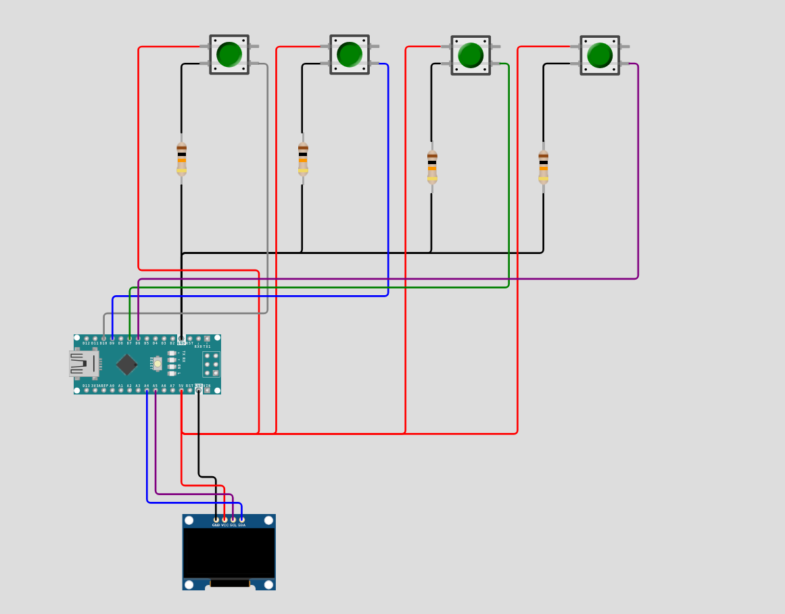

# Arduino Snake Game - Complete Documentation & Installation Guide


https://github.com/user-attachments/assets/cbdf2769-f31c-4b05-85ca-c10b7b460a7b

 

## Overview

This is a classic Snake game implementation for Arduino using an OLED display (SH1106 128x64) and push buttons for controls. The game features progressive difficulty scaling, collision detection, and a clean OLED-based user interface.

## Hardware Requirements

### Components
- **Arduino Uno/Nano** (or compatible microcontroller)
- **OLED Display**: SH1106 128x64 pixels with I2C interface
- **Push Buttons**: 4x momentary push buttons
- **Resistors**: 4x 10kΩ pull-down resistors (optional if using internal pull-ups)
- **Breadboard and jumper wires**

### Pin Configuration
```
OLED Display (I2C):
- SDA → A4 (Arduino Uno) / A4 (Arduino Nano)
- SCL → A5 (Arduino Uno) / A5 (Arduino Nano)
- VCC → 5V
- GND → GND

Push Buttons:
- Right Button → Pin 10
- Down Button  → Pin 9
- Left Button  → Pin 7
- Up Button    → Pin 6
```

## Software Dependencies

### Required Libraries
1. **U8g2lib** - OLED display driver
   - Install via Arduino Library Manager: `Tools → Manage Libraries → Search "U8g2"`
   - Version: Latest stable release

### Library Installation Steps
1. Open Arduino IDE
2. Navigate to `Tools → Manage Libraries`
3. Search for "U8g2" by oliver
4. Install the latest version
5. Restart Arduino IDE

## Circuit Diagram

```
Arduino Uno/Nano          SH1106 OLED          Push Buttons
    A4 ────────────────── SDA
    A5 ────────────────── SCL
    5V ────────────────── VCC
   GND ────────────────── GND
   
   Pin 6 ──┤ ├── UP Button    ── GND
   Pin 7 ──┤ ├── LEFT Button  ── GND  
   Pin 9 ──┤ ├── DOWN Button  ── GND
   Pin 10 ─┤ ├── RIGHT Button ── GND
```

## Code Architecture

### Core Components

#### 1. Display Management
- **Driver**: U8G2 library with SH1106 128x64 configuration
- **Rendering**: Double-buffered page-based rendering for smooth graphics
- **Font**: 5x7 and 7x13 pixel fonts for UI elements

#### 2. Game State Management
```cpp
struct Point {
  int x, y;  // Grid-aligned coordinates
};

// Core game variables
Point snake[MAX_SNAKE_LENGTH];  // Snake segments array
int snake_length;               // Current snake length
Point food;                     // Food position
int score;                      // Player score
bool game_over;                 // Game state flag
```

#### 3. Input System
- **Debounced button reading** with direction validation
- **Anti-reverse logic** prevents 180° direction changes
- **State machine** for direction changes between game ticks

#### 4. Game Logic Flow
```
Input Handling → Movement Calculation → Collision Detection → 
Growth Logic → Food Generation → Rendering → Repeat
```

## Key Features

### Progressive Difficulty
- **Starting speed**: 600ms per move
- **Speed increase**: Every 3 points scored
- **Speed reduction**: 20ms per level
- **Minimum speed**: 80ms (maximum difficulty)

### Collision System
1. **Wall Collision**: Boundary checking for screen edges
2. **Self Collision**: Head-to-body intersection detection
3. **Food Collision**: Exact coordinate matching for food consumption

### Grid-Based Movement
- **Grid size**: 4x4 pixels
- **Aligned positioning**: All movements snap to grid
- **Smooth animation**: Consistent timing-based updates

## Installation Instructions

### Step 1: Hardware Assembly
1. Connect the OLED display using I2C (SDA to A4, SCL to A5)
2. Wire the four push buttons to pins 6, 7, 9, and 10
3. Connect power (5V) and ground to all components
4. Optional: Add 10kΩ pull-down resistors to buttons

### Step 2: Software Setup
1. Install Arduino IDE (version 1.8.0 or newer)
2. Clone the project using git
3. Install U8g2 library via Library Manager
4. Connect Arduino to computer via USB
5. Select correct board type in `Tools → Board`
6. Select correct COM port in `Tools → Port`

### Step 3: Code Upload
1. Copy the provided code into Arduino IDE
2. Verify compilation with `Ctrl+R` (or verify button)
3. Upload to Arduino with `Ctrl+U` (or upload button)
4. Open Serial Monitor (9600 baud) for debugging if needed

### Step 4: Testing
1. Power on the system
2. Verify OLED display shows game screen
3. Test all four directional buttons
4. Confirm snake movement and food generation

## Configuration Options

### Game Tuning Parameters
```cpp
#define MAX_SNAKE_LENGTH 100    // Maximum possible snake length
#define GRID_SIZE 4             // Pixel size of each grid cell
#define SCREEN_WIDTH 128        // Display width in pixels
#define SCREEN_HEIGHT 64        // Display height in pixels

int game_speed = 600;           // Starting speed (milliseconds)
```

### Button Pin Reassignment
```cpp
#define BTN_RIGHT 10   // Change pin numbers as needed
#define BTN_DOWN 9
#define BTN_LEFT 7
#define BTN_UP 6
```

## Troubleshooting

### Common Issues

#### Display Not Working
- **Check I2C connections** (SDA/SCL to A4/A5)
- **Verify power supply** (5V and GND properly connected)
- **Library version** - ensure U8g2 is latest version
- **Display type** - confirm SH1106 vs SSD1306 controller

#### Buttons Not Responsive
- **Pin configuration** - verify button pins match code definitions
- **Pull-up resistors** - add external pull-downs or enable internal pull-ups
- **Debouncing issues** - check for proper button wiring

#### Game Logic Issues
- **Erratic movement** - check timing loop and millis() overflow handling
- **Collision detection** - verify grid alignment in food generation
- **Memory issues** - monitor RAM usage with large snake lengths

### Debug Mode
Add serial output for debugging:
```cpp
void setup() {
  Serial.begin(9600);  // Enable for debugging
  // ... rest of setup
}

// Add debug prints in game loop
Serial.print("Snake head: ");
Serial.print(snake[0].x);
Serial.print(", ");
Serial.println(snake[0].y);
```

## Performance Considerations

### Memory Usage
- **Static allocation**: Fixed arrays prevent heap fragmentation
- **Struct optimization**: Point struct uses int (2 bytes each)
- **Total RAM usage**: ~800 bytes for game state

### Timing Optimization
- **Non-blocking delays**: Uses millis() instead of delay()
- **Efficient rendering**: Page-based updates minimize display write cycles
- **Input polling**: Samples buttons every game loop iteration


## License
This project is licensed under the MIT License - see the [LICENSE](LICENSE) file for details.
