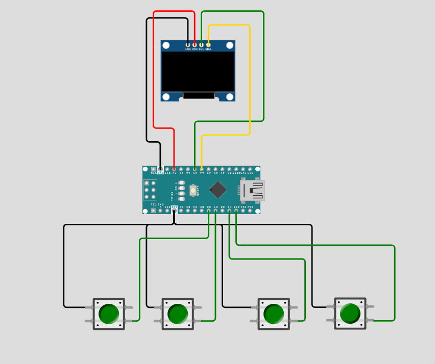

# Arduino Snake Game 🐍

<p align="center">
  
</p>

<p align="center">
  <a href="#features">Features</a> •
  <a href="#hardware-requirements">Hardware</a> •
  <a href="#installation">Installation</a> •
  <a href="#usage">Usage</a> •
  <a href="#configuration">Configuration</a> •
  <a href="#troubleshooting">Troubleshooting</a>
</p>

<p align="center">
  
  
  
</p>

---

## 📖 Overview

A faithful recreation of the classic Nokia Snake game for Arduino microcontrollers. This project combines retro gaming nostalgia with modern embedded programming practices, featuring smooth OLED graphics, responsive controls, and progressively challenging gameplay.

## ✨ Features

- 🎮 **Classic Snake Gameplay** - Faithful recreation of the Nokia original
- 📈 **Progressive Difficulty** - Game speeds up as your score increases
- 🎯 **Smart Collision Detection** - Wall, self-collision, and food detection
- 💾 **Memory Efficient** - Only ~800 bytes RAM usage
- 🖥️ **Crisp OLED Display** - Double-buffered rendering for smooth graphics
- 🕹️ **Responsive Controls** - Anti-reverse logic prevents accidental deaths
- 🔄 **Instant Restart** - Press any button to play again
- 📊 **Real-time Score Tracking** - See your progress on screen

## 🛠️ Hardware Requirements

### Components List

| Component | Specification | Quantity |
|-----------|--------------|----------|
| Arduino Board | Uno/Nano (ATmega328P) | 1 |
| OLED Display | SH1106 128x64 (I2C) | 1 |
| Push Buttons | Momentary tactile switches | 4 |
| Breadboard | Standard size | 1 |
| Jumper Wires | Male-to-male | ~10 |

**Estimated Cost:** $12-15 USD

### Pin Configuration

```
┌─────────────────┐
│   OLED Display  │
│   (SH1106 I2C)  │
└─────────────────┘
    │   │   │   │
   SDA SCL VCC GND
    │   │   │   │
    A4  A5  5V  GND ← Arduino
    
┌──────────────────────┐
│   Push Buttons       │
├──────────────────────┤
│ UP    → Pin 6        │
│ LEFT  → Pin 7        │
│ DOWN  → Pin 9        │
│ RIGHT → Pin 10       │
│ (All buttons → GND)  │
└──────────────────────┘
```

## 📦 Software Dependencies

### Required Libraries

- **U8g2lib** - High-performance OLED display driver
  - **Installation:** Arduino IDE → Tools → Manage Libraries → Search "U8g2" → Install
  - **Version:** Latest stable (tested with v2.35+)
  - **Author:** olikraus

## 🚀 Installation

Choose your preferred installation method:

### Method 1: Download from Releases (Recommended for Beginners)

1. **Download the Latest Release**
   - Go to [Releases](https://github.com/yourusername/arduino-snake-game/releases)
   - Download the latest `snake_arduino.ino` file
   - Save it to a folder named `snake_arduino`

2. **Install U8g2 Library**
   - Open Arduino IDE
   - Navigate to `Tools` → `Manage Libraries`
   - Search for "U8g2" by oliver
   - Click `Install`
   - Restart Arduino IDE

3. **Hardware Setup**
   - Connect OLED display to I2C pins (A4/SDA, A5/SCL)
   - Wire push buttons to pins 6, 7, 9, and 10
   - Connect 5V and GND to all components

4. **Upload Code**
   - Open `snake_game.ino` in Arduino IDE
   - Select your board: `Tools` → `Board` → `Arduino Uno/Nano`
   - Select your port: `Tools` → `Port` → (your Arduino port)
   - Click Upload (Ctrl+U / ⌘+U)

5. **Play!**
   - Game starts automatically after upload
   - Use directional buttons to control the snake
   - Eat food to grow and increase score

### Method 2: Clone from Git

1. **Clone the Repository**
   ```bash
   git clone https://github.com/aydakikio/arduino_snake.git
   cd arduino_snake
   ```

2. **Install U8g2 Library** (same as Method 1, step 2)

3. **Follow steps 3-5 from Method 1**

> **Note:** Arduino IDE requires `.ino` files to be in a folder with the same name (e.g., `snake_arduino.ino` must be in a `Source_Code/` folder)

### Detailed Wiring Diagram

<p align="center">
  
</p>

## 🎮 Usage

### Game Controls

| Button | Action |
|--------|--------|
| UP | Move snake upward |
| DOWN | Move snake downward |
| LEFT | Move snake left |
| RIGHT | Move snake right |
| ANY (Game Over) | Restart game |

### Gameplay Rules

1. **Objective:** Eat food (small squares) to grow your snake and increase score
2. **Speed:** Game gets faster every 3 points (600ms → 80ms)
3. **Game Over:** Hitting walls or yourself ends the game
4. **Scoring:** +1 point per food eaten
5. **No Reverse:** Can't make 180° turns (prevents accidental death)

## ⚙️ Configuration

### Gameplay Tuning

Customize game behavior in the source code:

```cpp
// Game difficulty settings
#define MAX_SNAKE_LENGTH 100    // Maximum snake size
#define GRID_SIZE 4             // Pixel size of grid cells
int game_speed = 600;           // Starting speed (ms per move)

// Speed progression (in checkCollisions function)
if (score % 3 == 0 && game_speed > 80) {
  game_speed -= 20;  // Adjust speed increment
}
```

### Hardware Customization

**Change Button Pins:**
```cpp
#define BTN_RIGHT 10   // Modify these to match your wiring
#define BTN_DOWN 9
#define BTN_LEFT 7
#define BTN_UP 6
```

**Switch Display Controller:**
```cpp
// For SSD1306 displays, replace line 3 with:
U8G2_SSD1306_128X64_NONAME_2_HW_I2C u8g2(U8G2_R0, U8X8_PIN_NONE);
```

## 🏗️ Code Architecture

### System Design

```
┌─────────────────────────────────────┐
│         Main Game Loop              │
├─────────────────────────────────────┤
│  1. Handle Input (buttons)          │
│  2. Update Game State (timing)      │
│  3. Move Snake (grid-based)         │
│  4. Check Collisions (walls/self)   │
│  5. Process Food (growth/spawn)     │
│  6. Render Display (OLED)           │
└─────────────────────────────────────┘
```

### Key Components

**Data Structures:**
```cpp
struct Point {
  int x, y;  // Grid-aligned coordinates
};

Point snake[MAX_SNAKE_LENGTH];  // Snake body segments
Point food;                     // Food position
```

**Core Systems:**
- **Display:** U8G2 double-buffered page rendering
- **Input:** Polled button reading with direction validation
- **Timing:** Non-blocking `millis()` based updates
- **Physics:** Grid-snapped movement with collision detection

### Performance Metrics

| Metric | Value |
|--------|-------|
| RAM Usage | ~800 bytes |
| Flash Usage | ~15KB |
| Frame Rate | 60 FPS (display limited) |
| Input Latency | <16ms |
| Max Snake Length | 100 segments |

## 🐛 Troubleshooting

### Display Issues

**Problem:** OLED screen stays blank
- ✅ Verify I2C connections (SDA→A4, SCL→A5)
- ✅ Check power connections (VCC→5V, GND→GND)
- ✅ Confirm display controller type (SH1106 vs SSD1306)
- ✅ Test I2C scanner sketch to verify address
- ✅ Try swapping SDA/SCL wires

**Problem:** Display is rotated/mirrored
- Change `U8G2_R0` to `U8G2_R1`, `U8G2_R2`, or `U8G2_R3` in line 3

### Control Issues

**Problem:** Buttons not responding
- ✅ Verify correct pin numbers in code match hardware
- ✅ Check button wiring (should connect pin to GND)
- ✅ Test with multimeter or LED to confirm button function
- ✅ Add external 10kΩ pull-down resistors if needed

**Problem:** Snake moves erratically
- Check for loose button connections
- Verify only one button pressed at a time
- Add small capacitors (0.1µF) across buttons for debouncing

### Game Logic Issues

**Problem:** Food spawns inside snake
- This is prevented by algorithm, but if occurring:
- Check `generateFood()` function logic
- Verify `snake_length` is being tracked correctly

**Problem:** Game runs too slow/fast
- Adjust `game_speed` variable (higher = slower)
- Check timing loop isn't being blocked
- Verify `millis()` rollover handling

### Debug Mode

Enable serial debugging to diagnose issues:

```cpp
void setup() {
  Serial.begin(9600);  // Add to setup()
}

void loop() {
  // Add anywhere to monitor values
  Serial.print("Score: ");
  Serial.print(score);
  Serial.print(" | Speed: ");
  Serial.println(game_speed);
}
```

Open Serial Monitor (Tools → Serial Monitor) at 9600 baud to view output.

## 🤝 Contributing

Contributions are welcome! Here's how you can help:

1. **Fork** the repository
2. **Create** a feature branch (`git checkout -b feature/AmazingFeature`)
3. **Commit** your changes (`git commit -m 'Add some AmazingFeature'`)
4. **Push** to the branch (`git push origin feature/AmazingFeature`)
5. **Open** a Pull Request

Please ensure code follows existing style and includes comments.

## 📄 License

This project is licensed under the MIT License - see the [LICENSE](LICENSE) file for details.

You are free to use, modify, and distribute this code for personal and commercial projects.

## 🙏 Acknowledgments

- **U8g2 Library** by [olikraus](https://github.com/olikraus/u8g2) - Excellent OLED driver
- **Nokia** - For the original Snake game inspiration
- **Arduino Community** - For extensive documentation and support

## 📬 Contact & Support

- **Issues:** Found a bug? [Open an issue](https://github.com/aydakikio/arduino_snake/issues)
- **Discussions:** Have questions? [Start a discussion](https://github.com/aydakikio/arduino_snake/discussions)
